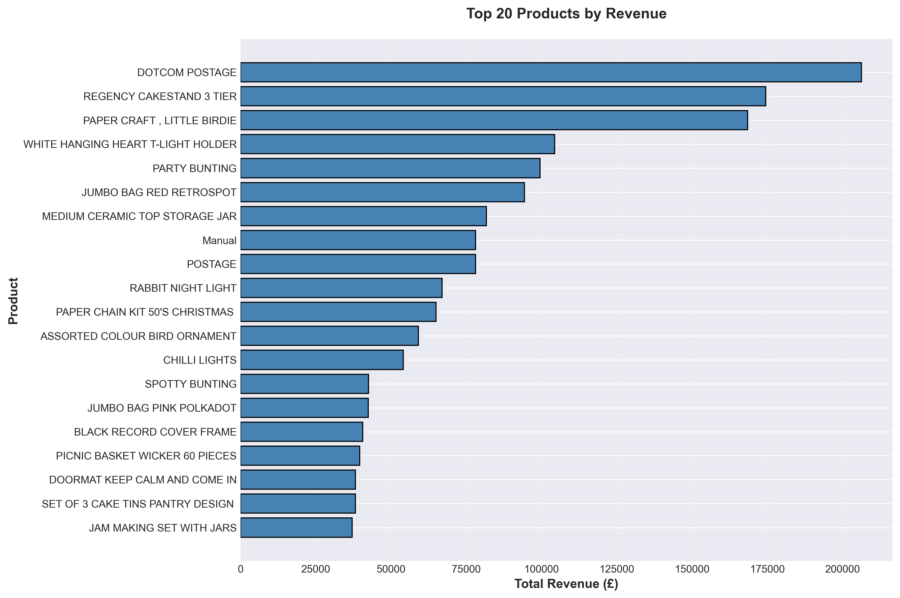
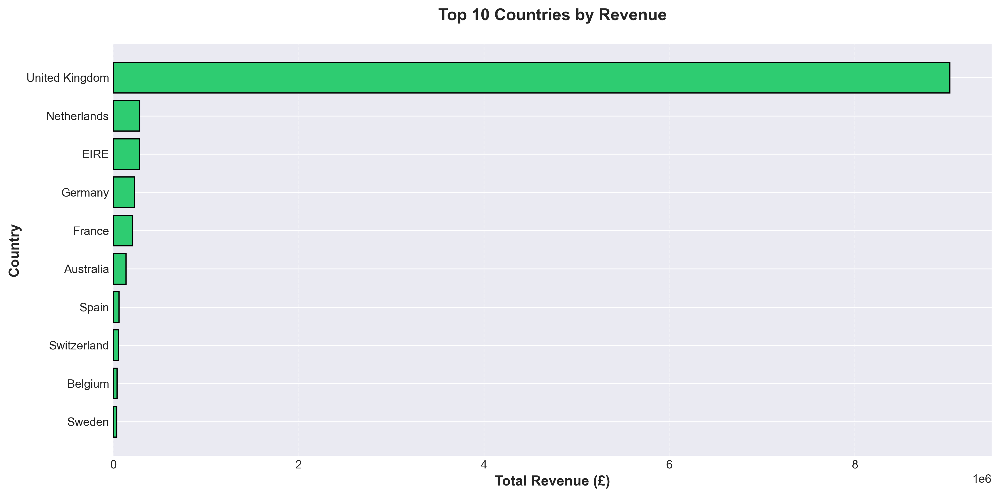
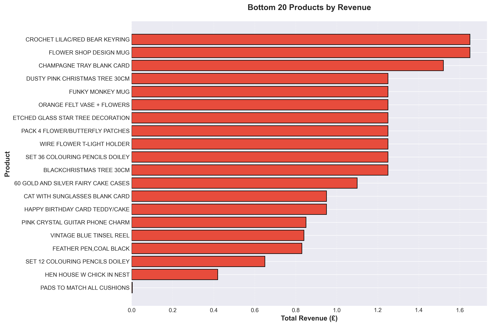

# Online Retail Transaction Analysis 🛒

A data analysis project where I dig into over 500,000 e-commerce transactions to answer real business questions about customers, products, and sales.

---

## What This Project Is About

I analyzed online retail data to help a business understand:
- **Who their customers are** and how they shop
- **Which products make the most money** (and which don't)
- **Where their revenue comes from** geographically
- **What products they should stop selling**

Think of this as helping an online store owner make smarter decisions with their data.

---

## The Dataset

**Source:** [Kaggle - Online Retail Transactions](https://www.kaggle.com/datasets/abhishekrp1517/online-retail-transactions-dataset)

**What's in it:**
- 541,909 transactions
- Data from December 2010 to December 2011
- 37 countries
- 4,372 unique customers
- 4,070 different products

**The columns:**
- Invoice number and date
- Product codes and descriptions
- Quantities sold
- Prices
- Customer IDs
- Countries

---

## Tools I Used

- **Python** - For all the analysis
- **Pandas** - To clean and work with the data
- **Matplotlib & Seaborn** - To create charts
- **Plotly** - For interactive visualizations
- **Jupyter Notebook** - Where I did all the work

---

## What I Did

### 1. Cleaned the Data
The raw data wasn't perfect, so I:
- Removed transactions with missing customer IDs
- Handled product returns (negative quantities)
- Fixed zero prices and weird values
- Created a "Revenue" column (Quantity × Price)
- Saved a clean version of the data

### 2. Analyzed Customer Behavior
Found out:
- How many unique customers there are
- How often customers buy
- Average spending per transaction
- How many customers come back vs. buy once

### 3. Looked at Product Performance
Discovered:
- Top 20 products by revenue
- Top 20 products by units sold
- "Star products" that excel in both
- The 80/20 rule: Do 20% of products make 80% of revenue?

### 4. Checked Geographic Data
Mapped out:
- Which countries spend the most
- UK vs. international revenue split
- Top 5 markets

### 5. Found Underperforming Products
Identified:
- Products that barely sell
- Items taking up space but making no money
- What should be discontinued

---

## What I Found

### 📄 Quick Summary
Want just the highlights? Check out the **[Executive Summary](data/Summary_of_Findings_&_Business_Recommendations.md)** in the data folder for a concise overview of all findings and recommendations.

### Customer Insights
- **4,338 customers** in total (1,493 + 2,845)
- Average customer buys **2.4 times**
- Average transaction: **£17.29**
- **65.6% are repeat customers** (34.4% bought only once)

**What this means:** About 1 in 3 customers buy once and disappear - there's an opportunity to bring them back and turn them into repeat buyers!

### Product Insights
- **Top product made £207,511** (DOTCOM POSTAGE)
- **11 products are "stars"** - high sales AND high revenue
- **328 products (8%) make 80% of revenue** - classic 80/20 rule!
- Top 20 products = 28% of all revenue

**What this means:** Focus on the products that actually make money. Stop worrying about the rest.

### Geographic Insights
- **UK = 82.7% of revenue** (£6.7M)
- **Netherlands is #1 internationally** (£228K)
- Top 5 countries = 94% of all revenue
- 37 countries total, but most barely contribute

**What this means:** The UK is huge, but international markets have growth potential.

### Underperforming Products
- Bottom 20 products made **less than £1 combined**
- 500+ products made **less than £10 total**
- Some products sold only **1 unit ever**

**What this means:** Cut the dead weight. These products cost money to store but don't sell.

---

## My Recommendations

### 1. Win Back One-Time Buyers
**Problem:** 34% of customers (1,493 people) only bought once.

**Solution:**
- Send them an email with a discount
- Show them products similar to what they bought
- Create a loyalty program

**Goal:** Turn one-time buyers into repeat customers.

---

### 2. Focus on What Works
**Problem:** Too many products, most don't sell well.

**Solution:**
- Stock more of the 328 products making 80% of revenue
- Market the 11 "star products" heavily
- Clearance sale for the bottom 500 products
- Stop ordering products that don't sell

**Goal:** Make inventory management easier and more profitable.

---

### 3. Grow International Sales
**Problem:** Only 17% of revenue comes from outside the UK.

**Solution:**
- Run ads in Netherlands, Germany, and France
- Check if shipping costs are too high internationally
- Offer international payment methods
- Test new European markets

**Goal:** Grow revenue without depending 100% on the UK market.

---

### 4. Clean Up the Product Catalog
**Problem:** Dead inventory costs money to store.

**Solution:**
- Remove products that sold <10 units total
- Use warehouse space for popular items instead
- Focus buyer attention on products that actually sell

**Goal:** Lower costs, improve efficiency.

---

## The Charts

Here's what the data looks like visually:

### Customer Segmentation: One-Time vs Repeat Customers

*Shows that 65.6% of customers are repeat buyers - a good sign for the business!*

### Top 20 Products by Revenue

*DOTCOM POSTAGE leads with over £200K in revenue*

### Top 10 Countries by Revenue

*UK dominates, but Netherlands, Ireland, Germany, and France show strong international presence*

### Bottom 20 Products by Revenue

*Products that should probably be discontinued - they're barely making any money*

---

## How to Run This Project Yourself

### What You Need:
- Python 3.8 or newer
- Jupyter Notebook

### Step 1: Clone This Repository
```bash
git clone https://github.com/YOUR_USERNAME/online-retail-analysis.git
cd online-retail-analysis
```

### Step 2: Install the Libraries
```bash
pip install pandas numpy matplotlib seaborn plotly jupyter
```

### Step 3: Get the Dataset
1. Download the dataset from [Kaggle](https://www.kaggle.com/datasets/abhishekrp1517/online-retail-transactions-dataset)
2. Put the `online_retail.csv` file in the `data/` folder

### Step 4: Open and Run
```bash
jupyter notebook
```
Then open `Online_Retail_Transaction_Analysis.ipynb` and run all the cells.

**Quick Read Option:** If you just want the findings without running code, check out `data/Summary_of_Findings_&_Business_Recommendations.md` for the complete executive summary.

---

## Project Structure

```
online-retail-analysis/
│
├── data/
│   ├── online_retail_cleaned.csv      # Clean data (original not included - too big!)
│   └── Summary_of_Findings_&_Business_Recommendations.md    # Executive summary
│
├── notebooks/
│   └── Online_Retail_Transaction_Analysis.ipynb    # All the analysis
│
├── images/                             # All the charts
│   ├── customer_repeat_purchase.png
│   ├── top_products_revenue.png
│   ├── geographic_analysis.png
│   └── underperforming_products.png
│
├── .gitignore
└── README.md
```

---

## What I Learned

This was my first data analysis project, and here's what I figured out:

1. **Real data is messy** - You have to clean it before you can analyze it
2. **The 80/20 rule is real** - A small portion of products really do drive most revenue
3. **Visuals matter** - Charts make insights way easier to understand
4. **Business questions come first** - Don't just analyze for the sake of it. Answer real questions.

---

## What's Next?

Things I could add to this project:
- **Time series analysis** - Are there seasonal patterns? Do sales spike in December?
- **Customer segmentation** - Group customers by behavior (big spenders vs. bargain hunters)
- **Predict future sales** - Use past data to forecast what might happen next
- **Market basket analysis** - What products are bought together?

---

## About Me

**Mitesh Kumar**

This is my first data analysis project! I'm learning Python, data analysis, and how to tell stories with data.

- 💼 [LinkedIn](#) - *Add your link*
- 📧 [Email](#) - *Add your email*
- 🐙 [GitHub](#) - *Add your profile*

---

## Acknowledgments

- Dataset from [Kaggle](https://www.kaggle.com/datasets/abhishekrp1517/online-retail-transactions-dataset)
- Built as part of my coursework learning data analysis
- Thanks to everyone who helped me learn Python and pandas!

---

## License

Feel free to use this project for learning. If you use it, a mention would be appreciated!

---

**⭐ If this helped you learn something, give it a star!**

---

*Project completed: November 2025*
